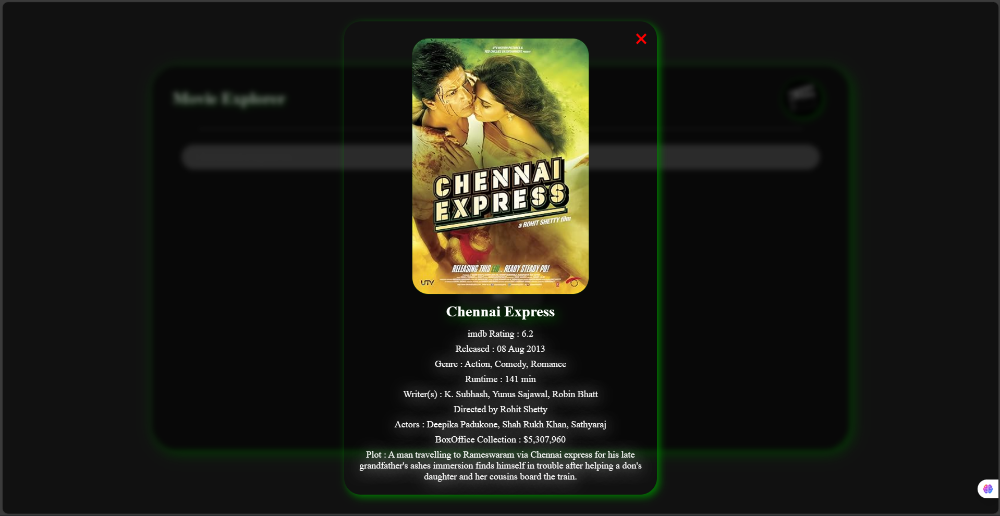
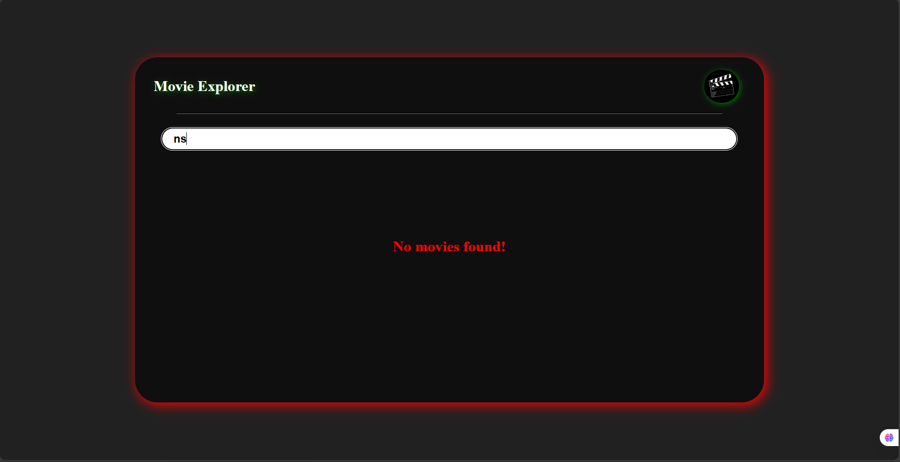

# 🎬 Movie Explorer

**Movie Explorer** is a React-based web app that lets users explore, search, and discover movies easily. It fetches real-time data from a movie API and displays movie details like posters, ratings, and descriptions in a clean and responsive UI.

---

## 🚀 Features

- 🔍 **Search Movies:** Find movies by title instantly.  
- 🧠 **Dynamic Results:** Fetches real-time data using an external API.  
- 📄 **Movie Details:** View information like release date, rating, and overview.  
- 💅 **Responsive Design:** Works seamlessly on desktop and mobile devices.  

---

## 🛠️ Tech Stack

* **React.js**
* **Axios** (for API requests)
* **Omdb API**
* **CSS3**

---

## 📸 Preview

---